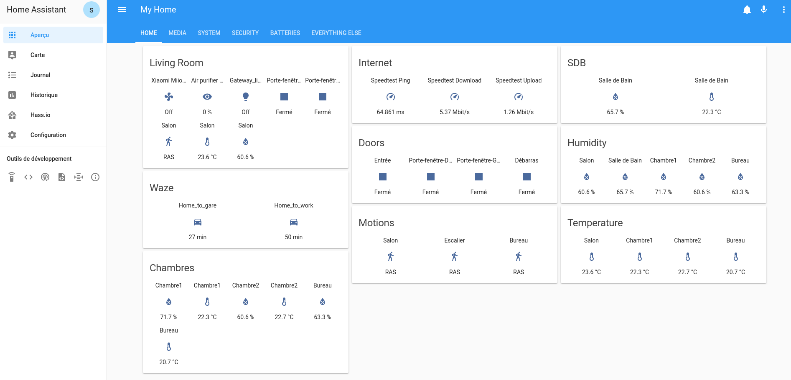

# Home Assistant Configuration  

Here's my [Home Assistant](https://home-assistant.io/) configuration. I have installed HA on an [HP ProLiant MicroServer G7](https://amzn.to/2CXyVs0) with [8GB RAM](https://amzn.to/2TBaAxs) and [240GB SSD](https://amzn.to/2TyWfBR). I am currently running Fedora 29 Server on the MicroServer G7 and used the [alternative-install-on-generic-linux-server](https://www.home-assistant.io/hassio/installation/#alternative-install-on-generic-linux-server) approach to install HA.

My current HA version:  0.85.1

# <a name="menu">Menu</a>
 | [Gateway](#gateway) | [Sensors](#sensors) | [Voice Interaction](#voiceinteraction) | [Software](#software) |

## <a name="gateway">Gateway</a>

| [Go to Menu](#gateway) |

| Device  | Quantity | Connection | Home Assistant | Notes |
| ------------- | :---: | ------------- | ------------- | ------------- |
| [Xiaomi Aqara](http://bit.ly/2CXK3Fu) | 1 | IP | [Xiaomi Aqara](https://www.home-assistant.io/components/xiaomi_aqara/) | For Zigbee sensors|
| [Z-Wave Plus Z-Stick GEN5 - Aeon Labs](https://amzn.to/2TwgrEu) | 1 | USB | [Z-Wave](https://www.home-assistant.io/components/zwave/) | Provides interface to Z-Wave Mesh Network devices|
| [RFXCOM RFXtrx433E](http://bit.ly/2CWB8UH) | 1 | USB | [RFXTRX](https://www.home-assistant.io/components/rfxtrx/) | Enables RX/TX of 433Mhz signals over a range of protocols|

## <a name="sensors">Sensors</a>

| [Go to Menu](#Sensors) |

| Device | Connection | Home Assistant | Notes |
| ------------- | ------------- | ------------- | ------------- |
| [Door/Windows Sensor](http://bit.ly/2TCeK8w) | ZigBee | [Xiaomi Aqara](https://www.home-assistant.io/components/xiaomi_aqara/) | Xiaomi Door Windows Sensor|
| [Human Body Sensor](http://bit.ly/2CY3AVZ) | ZigBee | [Xiaomi Aqara](https://www.home-assistant.io/components/xiaomi_aqara/) | Xiaomi Human Body Sensor |
| [Temperature and Humidity Sensor ](http://bit.ly/2TCDA88) | ZigBee | [Xiaomi Aqara](https://www.home-assistant.io/components/xiaomi_aqara/) | Xiaomi Temperature and Humidity Sensor|
| [Temperature and Humidity Sensor THGR 122 NX](https://amzn.to/2CYorIW) | RF433 | [sensor rfxtrx](https://www.home-assistant.io/components/sensor.rfxtrx/) | Oregon Scientific Temperature and Humidity Sensor|

## <a name="voiceinteraction">Voice Interaction</a>

| [Go to Menu](#voiceinteraction) |

| Device | Connection | Home Assistant | Notes |
| ------------- | ------------- | ------------- | ------------- |
| [Amazon Echo Dot](https://amzn.to/2TH6xjv) | Home Assistant Cloud | [Cloud](https://www.home-assistant.io/components/cloud/) | Custom skills via Alexa API|

## <a name="software">Software</a>

| [Go to Menu](#menu) |

| Device  | Connection | Home Assistant | Notes |
| ------------- | ------------- | ------------- | ------------- |
| [Docker](https://www.docker.com) | Ethernet | [Installation on Docker](https://www.home-assistant.io/docs/installation/docker/) | Home Assistant install runs as a Docker Container |
| [Pi-hole](https://pi-hole.net) | Ethernet / Wi-Fi | [Pi-Hole Sensor](https://www.home-assistant.io/components/sensor.pi_hole/) | Ad blocking |

| [Go to Menu](#menu) |

**All files are now being edited with [Atom](https://atom.io/).**

**All of my configuration files are tested against the most stable version of home-assistant using [Travis](https://travis-ci.org/lbtm/home-assistant-config).**

# Screenshots
#### HA Dashboard

| [Go to Menu](#menu) |
